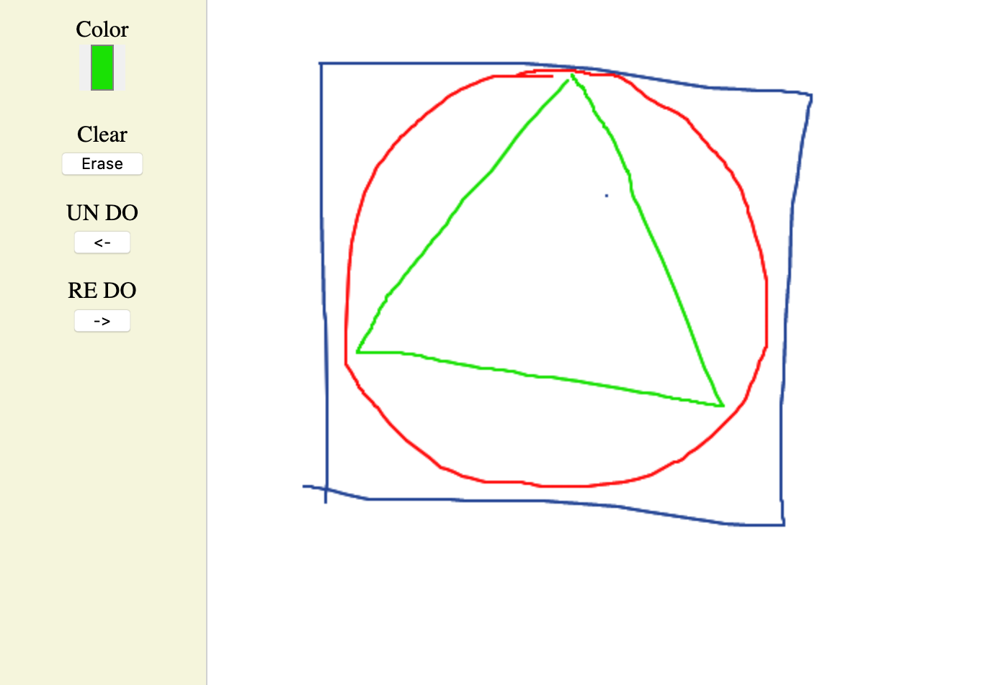

[](http://www.virdhitechlab.in)

# [React canvas sketch](https://www.npmjs.com/package/@vhitech/canvas-sketch)

The project provides a react library, that helps build a free hand drawing board on top of HTML5 Canvas. 

 

Check out the **[Demo App](https://fir-view-e11aa.firebaseapp.com/)**


## Installation

For Yarn users

`yarn @vhitech/canvas-sketch`

For npm users

`npm i @vhitech/canvas-sketch`


## Usage

You can Import the library as shown below

```
import Sketch, { TOOL } from "@vhitech/canvas-sketch";
``` 

Maintain a state variable that helps track the coordinates of your drawing.
Define a method to set the state as well. 

```
state = {
    drawingInput: []
}

setDrawingInput = data => {
    this.setState({ drawingInput: data });
};
  
```

If you are using React Hooks the code may look like this

```
const [drawingInput, setDrawingInput] = useState([]);  

```


Create a Sketch as shown below. 
```
<div className={styles.sketch}>
  <Sketch
    ref={e => (this.sketch = e)}
    tool={TOOL.PENCIL}
    color="#234494"
    drawInput={drawingInput}
    updateToolInfo={this.setDrawingInput}
  />
</div>

```

This would embed a HTML5 Canvas on which you will be able to draw. 
Check out our [example code](./example/src/App.js)

